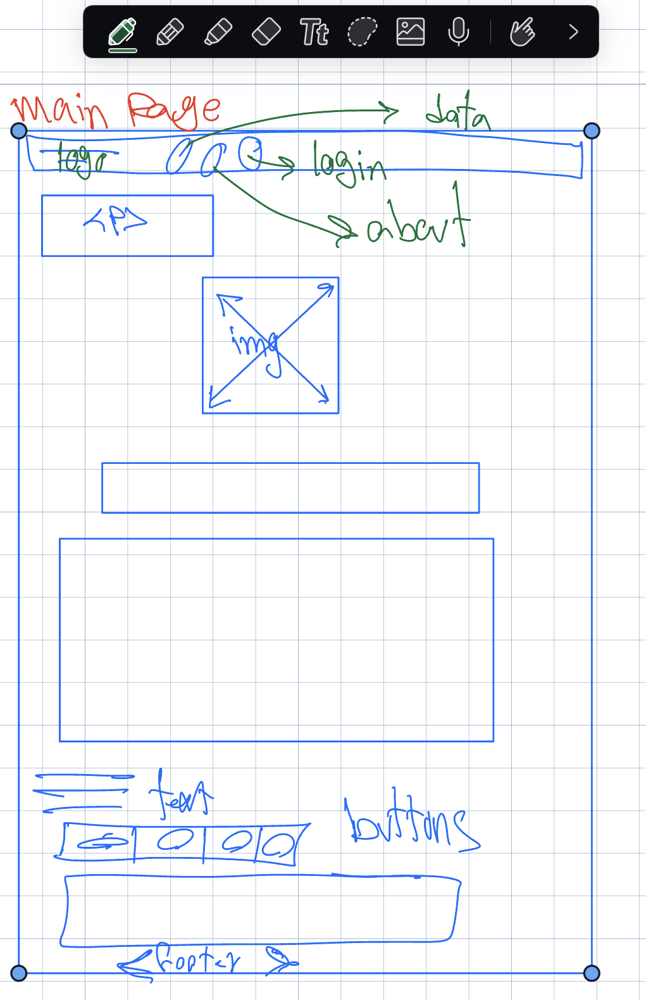
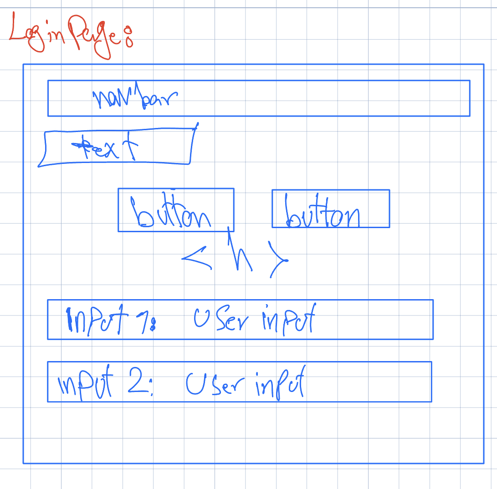
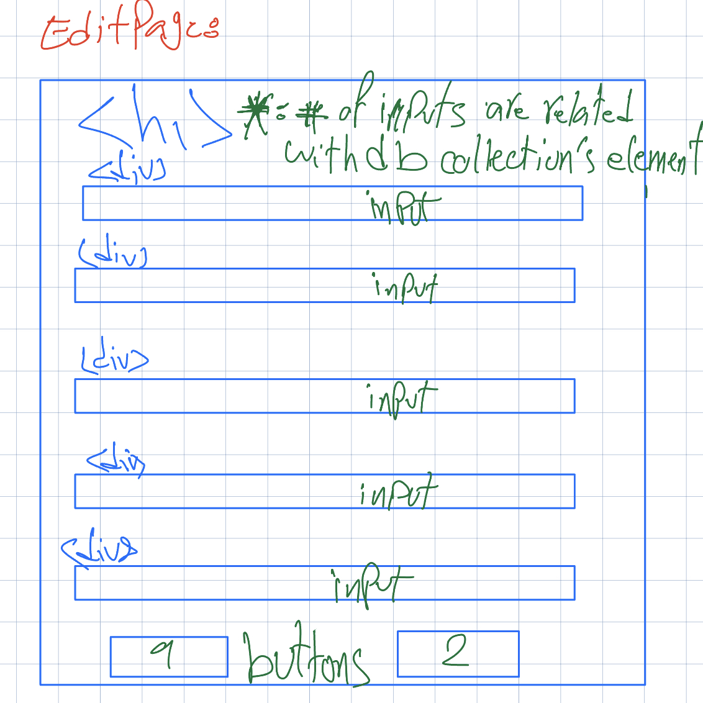
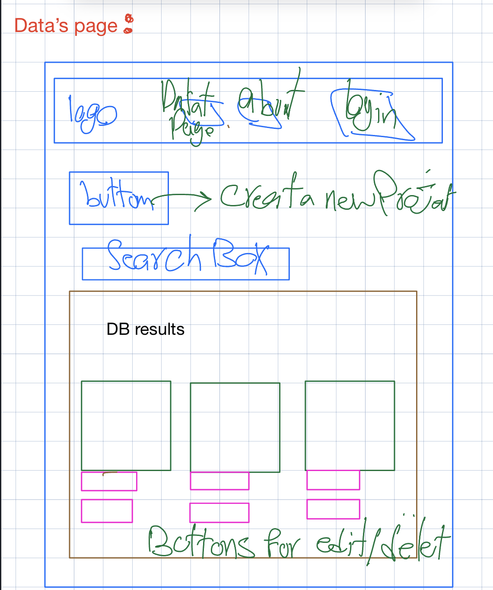

# moneyMaster

moneyMaster is a managing application for bank accounts which gives a use an opportunity to, manage all their credit cards all at one place. an user can create/delete/modify/view his bank accounts.

Createed by Ali Saremi

### Design Document:



 

#### slides:

[Slides presentation](https://docs.google.com/presentation/d/1EPZiVV4H_JwtapBzgIOujojJo_Lgmi68OzKlkjXnTdI/edit?usp=sharing)

## Demo

[](https://www.youtube.com/watch?v=LpvGg0Jy8AY)

## Installation

To set up moneyMaster, you'll need the following:

Clone the repository: git@github.com:s4remi/moneyMaster.git

## Navigate to the root directory:

```
cd moneyMaster
```

## Install dependencies:

```
npm install
cd front
npm install
npm run build
cd..
npm start

```

## Dependencies: Back-end

```
"cookie-parser": "~1.4.4",
"crypto": "^1.0.1",
"debug": "~2.6.9",
"dotenv": "^16.3.1",
"express": "^4.18.2",
"express-session": "^1.17.3",
"mongodb": "^6.2.0",
"morgan": "~1.9.1",
"passport": "^0.6.0",
"passport-local": "^1.0.0"

```

## Dependencies: front-end

```
  "dependencies": {
    "react": "^18.2.0",
    "react-dom": "^18.2.0",
    "react-router-dom": "^6.19.0"
  },
```

//add html link

### brief overview of the components:

### Server-Side (Node.js with Express):

    app.js: The main entry point for the server-side code. It sets up Express, defines middleware (such as logging, cookie parsing, and static file serving), configures sessions, and handles routing.

    routes/index.js: Defines routes for handling API requests related to data retrieval.

    routes/auth.js: Contains routes for user authentication (login, logout, signup).

    routes/bankAccs.js: Handles API requests related to banking accounts, including creation, updating, and deletion.

    myMongoDB.js: Connects to MongoDB and defines methods for interacting with the database, such as retrieving data, inserting users, and managing bank accounts.

### Client-Side (React):

    index.html: The main HTML file that includes the root element where the React app is mounted.

    index.css: Styles for the React app, including the ones you provided and additional styles.

    main.jsx: The main entry point for the client-side React code. It sets up routing and renders the root component.

    pages: Contains React components for different pages (DatasPage, AboutPage, LoginPage, EditPage).

### Authentication:

    Passport.js is used for authentication, specifically the LocalStrategy for username/password-based authentication.

### Database:

    MongoDB is used as the database, and the myMongoDB.js file contains functions for interacting with it.

### External Libraries:

    Bootstrap is included for styling in the HTML file.

## License

This project is licensed under the MIT license.
